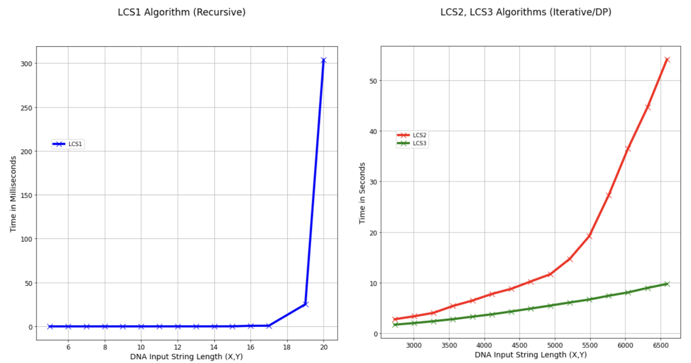

## Programming Project 3 - Fall 2022 (Gerald McCollam)
## EN.605.620.81.FA22 Algorithms for Bioinformatics

### Requirements

  * Python 3+ is required. No external libraries used.

### Execution & Output

The program is made up of several modules. The user interacts with the file `driver.py`. To learn more, please type the following at the command prompt: 

```
>> python driver.py -h
```

and the following message will be displayed.

```
usage: driver.py [-h] --input INFILE [--output OUTPUT]

optional arguments:
  -h, --help       show this help message and exit
  --input INFILE   input file
  --output OUTPUT  output file name
```

The code is delivered as a zipped folder. Once unzipped it has the following directory structure:

```
.
├── README.md
├── algos
│   ├── __init__.py
│   └── algorithms.py
├── analysis
│   ├── __init__.py
│   ├── metrics.py
│   └── perf_runner.ipynb
├── data
│   └── Input.txt
├── driver.py
└── filehandler
    ├── __init__.py
    └── io.py
```
To run the program change directories to `GMcC-PP03` and execute the file `driver.py` as described. To run student supplied data execute the following command:

```
>> python driver.py --input ./data/Additional.txt --output ./docs/output.txt
```

To run the data supplied as part of the assignment execute the following command:
```
>> python driver.py --input ./data/Input.txt --output ./docs/output.txt
```

### Supporting Code

There are several modules contained in this submission:

The module `analysis` contains functions for profiling the code, notably `profile` which provides a means of 
instrumenting each LCS algorithm and measuring its performance. The module also contains functions for randomly generating DNA strings 
of varying length. Finally, it includes an *.ipynb notebook for re-creating the plots included in the accompanying report. 

The module `filehandler` contains the function `pre_process` which loads provided data from file and renders it as a dictionary for the three algorithms.  

Finally, the `algorithms` module provides three implementations of the longest common subsequence problem. `LCS1` is a recursive solution; `LCS2` and `LCS3` are dynamic programming solutions. 

### Performance:

Following is a performance plot of the three algorithms: LCS1 (recursive), LCS2 and LCS3 (DP/iterative).



### Contact:

 Email to student: gmccoll2@jhu.edu

 
 